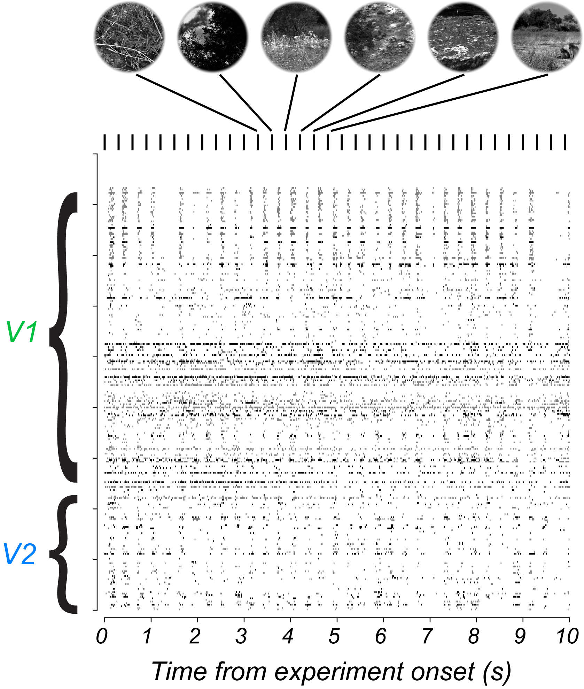
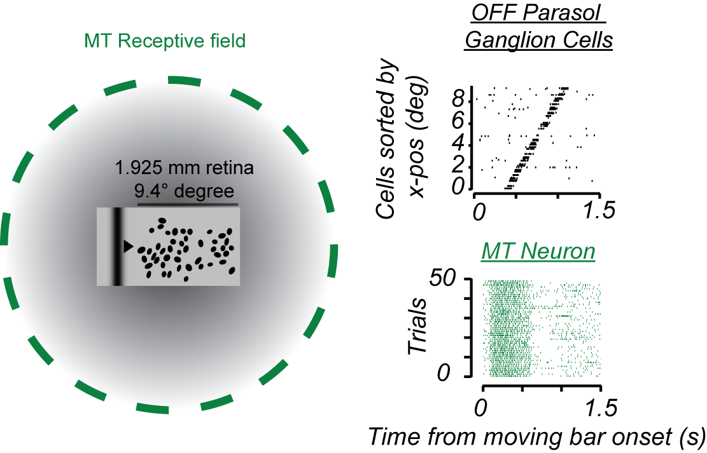

 Broadly, I am interested in principles governing the function of the primate visual and visuomotor system. Below is a set of projects I have worked on, or am actively working on. A lot of my recent work is done in collaboration with other experimentalists and theorists. Where relevant I list my collaborators. 

#  Cortico-cerebellar circuits for eye movement control (2011-2016)

<table style="float:right; margin-right:10px;">
  <tbody>
    <tr>
      <td></td>
    </tr>
    <tr>
      <td><em>Simple and complex spikes from a Purkinje cell in the Oculomotor Vermis during smooth tracking of a point (Raghavan and Lisberger 2017).</em></td>
    </tr>
  </tbody>
</table>

## Papers
 Raghavan, R.T., and Joshua, M. (2017). Dissecting patterns of preparatory activity in the frontal eye fields during pursuit target selection. J Neurophysiol 118, 2216–2231. [doi](https://doi.org/10.1152/jn.00317.2017). 
 Raghavan, R.T., and Lisberger, S.G. (2017). Responses of Purkinje cells in the oculomotor vermis of monkeys during smooth pursuit eye movements and saccades: comparison with floccular complex. J Neurophysiol 118, 986–1001. [doi](https://doi.org/10.1152/jn.00209.2017). 
 Raghavan, R.T., Prevosto, V., and Sommer, M.A. (2016). Contribution of Cerebellar Loops to Action Timing. Curr Opin Behav Sci 8, 28–34. [doi](https://doi.org/10.1016/j.cobeha.2016.01.008).

## Conferences
 Raghavan RT, Lisberger SG (2015) Differences between Purkinje cell responses in floccular complex and oculomotor vermis during pursuit eye movements. Gordan Research Conference: Cerebellum.  

<p2>Raghavan RT, Prevosto V, Darie R, Sommer MA (2013) Timing activity in the lateral
cerebellum. Society for Neuroscience Abstract 647.01</p2>  

# Efficient coding in the early visual system

<table style="max-width:100%;  ">
  <thead >
    <tr>
         <td style="padding-right:auto;padding-left:auto;text-align:justify;"><h3 style="text-align:center;font-weight:normal;font-style:oblique;padding-left:25px;"> Testing a normative theory of V1/V2 neuron responses to natural images.</h3> <p2 style="text-align:center;font-weight:normal;font-style:oblique;padding-left:25px;"> Collaborators:  <a href="https://www.cns.nyu.edu/~eero/">Eero Simoncelli</a> , <a href="https://scholar.google.com/citations?user=NWe5qUcAAAAJ&hl=en">Tiago Marques</a>, <a href="https://mschrimpf.com/">Martin Schrimpf</a> </p2></td>
        <td style="border-right: 1px solid;border-width: thin thick;;padding-left:25px;"> </td>
        <td style="padding-left:auto;text-align:justify;"><h3 style="text-align:center;font-weight:normal;font-style:oblique;padding-left:25px;">How efficiently are retinal signals extracted by central cortical circuits?</h3> <p2 style="text-align:center;font-weight:normal;font-style:oblique;padding-left:25px;"> Collaborators: <a href="https://profiles.stanford.edu/chichilnisky">E.J. Chichilnisky</a> </p2></td>
    </tr>
    <tr>
      <td > </td>
      <td style="border-right: 1px solid;border-width: thin thick;"> </td>
      <td></td>
    </tr>
  </thead>
  <tbody>
    <tr >
      <td style="padding-right:auto;padding-left:auto;text-align:justify;vertical-align: top;"><em >Response of a population of monkey V1/V2 cells to rapid serial visual presentation of natural images. Neurons were recorded using a neuropixels array traversing V1 and V2. A normative theory of efficient coding (Ganguli and Simoncelli 2014) predicts that the average firing rate of all V1/V2 cells should be similar if tested with natural images vs drifting gratings.</em></td>
      <td style="border-right: 1px solid;border-width: thin thick;"> </td>
      <td style="padding-right:25px;padding-left:25px;text-align:justify;"><em>Recordings from retinal ganglion cells and single MT neurons in the monkey in response to the same stimulus. Receptive field of MT neuron chosen to cover population of retinal cells. Stimulus is a gaussian edged bar drifting within the center of the MT receptive field and across the receptive fields of 64 OFF parasol ganglion cells that feed it. </em></td>
    </tr>
  </tbody>
</table>

## Conferences

Raghavan RT, Movshon, JA, Chichilnisky, EJ Decoding of retinal motion signals by neurons in macaque cortical area MT. FASEB Retinal Neurobiology and Visual Processing Conference 2022 

Representation of natural scene statistics in the monkey's early visual cortex (<b>Talk @ COSYNE 2022</b>). [Brainscore workshop](https://www.brainscoreworkshop.com/). 

Raghavan, R.T., Movshon, J.A., and Chichilnisky, E.J. (2019). Decoding of retinal motion signals by cells in macaque MT. Journal of Vision 19, 165b–165b. [doi](https://doi.org/10.1167/19.10.165b).

# Geniculate and cortical gain control

